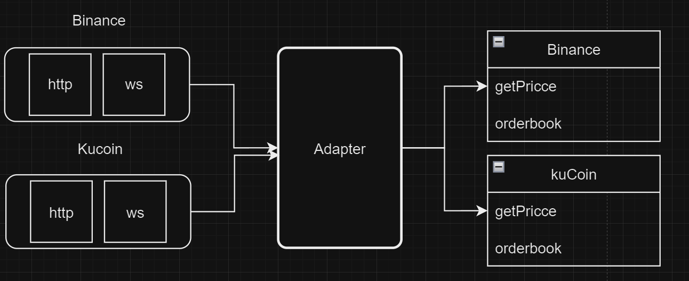

## Task

- [Framework](#framework)
- [Business-logic](#businessLogic)

# Framework

In the entry point of application we build routing for api, initialize clients (Binance, Kucoin), and set transport for our application (we can change it to http/ws or something else). I tried to make it transport agnostic.


## Clients



We could easily **add/remove** clients with using this architechture.

### How it Works

1. **Loading from config**
   Client could be loaded from the **config.js** file.

```javascript
activeClients: ["binance", "kucoin"],
clients: {
binance: {
    httpConnection: true,
    wsConnection: false,
    publicKey: "foo",
    privateKey: "bar",
    endpoints: {
    http: {
        depth: "https://api.binance.com/api/v3/depth",
        price: "https://api.binance.com/api/v3/ticker/price",
    },
},
},
kucoin: {
    httpConnection: true,
    wsConnection: false,
    publicKey: "foo",
    privateKey: "bar",
    endpoints: {
    http: {
        depth: "https://api.kucoin.com/api/v1/market/orderbook/level1",
        price: "https://api.kucoin.com/api/v1/mark-price",
     },
    },
    },
}
```

2. **Initialization**

```javascript
const clients = [];
for (const clientName of config.activeClients) {
  const clientConfig = config.clients[clientName];
  if (!clientConfig) continue;
  // there is a guarantee that either 'httpConnection' or 'wsConnection'
  // should have flag 'true' if 'config.activeClient' includes 'clientName'
  if (clientConfig.httpConnection) {
    const HTTPClient = require(`./clients/${clientName}/http.js`);
    const client = new HTTPClient(clientConfig);
    clients.push(client);
  }
  if (clientConfig.wsConnection) {
    const WSClient = require(`./clients/${clientName}/ws.js`);
    const client = new WSClient(clientConfig);
    clients.push(client);
  }
}
```

To **add,remove** client we can add such type of settings in the **config.js**. Config is flexible. It supports not only HTTP-requests stock-exhcange api, but also WebSockets and other transports could be added also.

## Routing

Routing has been built up with **filesystem**. In the **src/api/{enpointname}.js** we can easily adding endpoints. I've decided to put business-logic part here.

### How it Works

1. **Sandboxing**
   Business logic shouldn't know anything about fetching data directly from any stock-exchange but should work with clients instead. With **V8.createScipt** we can isolate context of the business logic and inject some items in the context with **V8.createContext()**.

```javascript
const fs = require("node:fs").promises;
const vm = require("node:vm");

module.exports = (options) => async (filePath, sandbox) => {
  const src = await fs.readFile(filePath, "utf8");
  const code = `'use strict';\n${src}`;
  const script = new vm.Script(code);
  const context = vm.createContext(Object.freeze({ ...sandbox }));
  const exported = script.runInContext(context, options);
  return exported;
};
```

## Transport layer

At any time we could change transport protocol. The current transport is **ws**. There is only boring machinery and nothing interestings happens...
Based on the contracts that **ws.js** file takes **(routing, port, console)** it could be easyly changed to let's say **http** protocol.

```javascript
const { Server } = require("ws");

module.exports = (routing, port, console) => {
  const ws = new Server({ port });

  ws.on("connection", (connection, req) => {
    const ip = req.socket.remoteAddress;

    connection.on("message", async (message) => {
      const obj = JSON.parse(message);
      const { name, method, args = {} } = obj;
      // checking endpoint
      const entity = routing[name];

      if (!entity) {
        connection.send('"Not found"', { binary: false });
        return;
      }

      // checking handler
      const handler = entity[method];
      if (!handler) {
        connection.send('"Not found"', { binary: false });
        return;
      }
      console.log(`${ip} ${name}.${method}(${args})`);
      // trying to calculate the result
      try {
        const result = await handler(args);
        connection.send(JSON.stringify(result), { binary: false });
      } catch (err) {
        console.dir({ err });
        connection.send('"Server error"', { binary: false });
      }
    });
  });

  console.log(`API on port ${port}`);
};
```

# Business-logic

Api has 2 endpiont:

1. **estimate**
   Estimates the output amount of a given currency based on the best ASK price from different clients. The method queries the order book for each client to find the lowest ask price
   for the specified currency pair. It then calculates the output amount using the
   best ask price found and the provided input amount.

**Request**:

```json
{
  "name": "estimate",
  "method": "estimate",
  "args": {
    "inputCurrency": "BTC",
    "outputCurrency": "USDT",
    "amount": "1"
  }
}
```

**Response**

```json
{
  "exchangeName": "binance",
  "ouputAmount": 69923.43
}
```

1. **getRates**
   Retrieves the current exchange rates for a given currency pair from multiple clients.
   The method queries each client for the current price of the specified currency pair, and then collects these prices into a list. Each entry in the list includes the price and the name of the exchange where the price was obtained.

**Request**:

```json
{
  "name": "getRates",
  "method": "getRates",
  "args": {
    "inputCurrency": "eth",
    "outputCurrency": "btc"
  }
}
```

**Response**

```json
[
  {
    "symbol": "ETHBTC",
    "price": 0.04841,
    "stockExchange": "binance"
  },
  {
    "symbol": "ETHBTC",
    "price": 0.04842,
    "stockExchange": "kucoin"
  }
]
```
